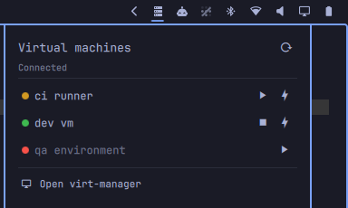

# Omarchy libvirt widget

A libvirt frontend for the [Omarchy](https://omarchy.org/) bar. The bar item is
a glyph, dimmed when nothing is running; the popup lists every domain on the
connection with a state light, play/stop controls, and a click-to-open console.



## Using it

Left click the bar item for the popup, right click to open virt-manager, middle
click or scroll to refresh.

- **Green** running, **amber** paused, **red** shut off. A row only shows the
  buttons its state allows.
- **The play arrow** starts a shut off domain, or resumes a paused one.
- **The stop square** is `virsh shutdown` — a polite ACPI request the guest can
  ignore.
- **The lightning bolt** is `virsh destroy`. It cuts power and loses unwritten
  guest state, so it takes two clicks: the first arms it, the second does it,
  and it disarms itself after four seconds.
- **Clicking a domain's name** opens its console in `virt-viewer`, only while
  the domain is up.

Under the title: **Connected** when libvirt answered the last poll,
**Disconnected** in red with the error below it when it did not. The URI is on
hover. The widget only reads and drives domains — it never starts libvirt, so a
dead connection is yours to bring up from a terminal.

`virsh shutdown` and friends return when the request is queued, not when the
guest acts on it, so expect a row to change state a beat after you click.

## Prerequisites

```bash
sudo pacman -S qemu-full libvirt virt-manager virt-viewer edk2-ovmf
```

| Package | Why |
|---|---|
| `libvirt` | **Required.** Provides `virsh`, the entire backend |
| `qemu-full` | The hypervisor, plus every guest architecture and its firmware |
| `virt-viewer` | **Required for consoles** — it is what clicking a domain name opens |
| `virt-manager` | Only the popup's footer button. Set `"manager": ""` to hide that row |
| `edk2-ovmf` | UEFI firmware for guests. Optional, but a modern guest usually wants it |

KVM needs no group membership on Arch — `/dev/kvm` is world-writable by udev
rule. Check with `test -w /dev/kvm && echo ok`.

The default connection, `qemu:///session`, needs no further setup: `virsh`
spawns `virtqemud` under your own user on first contact, guests get QEMU
user-mode networking, and definitions live in `~/.config/libvirt/`. The
trade-off is no inbound connections to guests and no networking between them.

For host-wide `qemu:///system` instead:

```bash
sudo usermod -aG libvirt $USER           # then log out and back in
sudo pacman -S dnsmasq                   # the default NAT network needs it
sudo systemctl enable --now virtqemud.socket virtnetworkd.socket virtstoraged.socket
sudo virsh net-autostart default && sudo virsh net-start default
```

`dnsmasq` is only an optional dependency of `libvirt`, but without it the
`default` NAT network cannot hand out DHCP and refuses to start. Hosts on the
monolithic daemon use `libvirtd.socket` in place of the three units above.

## Install

```bash
omarchy plugin add https://github.com/Leyanora/omarchy-libvirt.git --enable
```

The widget expects the connection to work without a password prompt. If
`virsh -c <uri> list --all` works in a terminal it works here; if it does not,
the popup shows you the same error.

## Uninstall

```bash
omarchy plugin remove leyanora.libvirt
```

That is the whole thing. It asks once (`--yes` skips), unloads the widget,
deletes `~/.config/omarchy/plugins/leyanora.libvirt`, and drops the widget's
entry — and with it every setting you put there — out of
`~/.config/omarchy/shell.json`.

Nothing of yours is touched: the widget only ever shells out to `virsh`, so
your domains, disks, networks and libvirt config are exactly as you left them.
The packages above stay installed.

The one thing that outlives the command is the crash-toast drop-in, and only
until you next log in — it lives in `$XDG_RUNTIME_DIR`, which is wiped with the
session. To be rid of it right now, either set `"suppressCrashToasts": false`
*before* removing the plugin, which deletes it on the spot, or clean up by hand
afterwards:

```bash
rm -f "$XDG_RUNTIME_DIR/systemd/user/omarchy-crash-watch.service.d/50-leyanora.libvirt.conf"
systemctl --user daemon-reload
systemctl --user restart omarchy-crash-watch.service
```

## Silencing the shutdown crash toast

Stopping a VM tends to raise an Omarchy "Process crashed: qemu-system-x86_64"
notification. That is not this plugin, and not `virt-viewer` either: libvirt
SIGTERMs QEMU, and QEMU segfaults inside its own SPICE teardown on the way out.
The guest has already stopped by then, so nothing is lost — it is an upstream
bug with no consequence beyond the toast. But you press the button that
triggers it here, so this is where it gets handled.

It is therefore **on by default**. Whenever the widget starts it writes a
drop-in at

```
$XDG_RUNTIME_DIR/systemd/user/omarchy-crash-watch.service.d/50-leyanora.libvirt.conf
```

that sets `OMARCHY_CRASH_IGNORE` for Omarchy's crash watcher — the supported
filter, nothing patched — then reloads and restarts it. An unchanged file is
left alone.

That path is the runtime unit directory, not `~/.config`, deliberately: Omarchy
has no uninstall hook for plugins, so a drop-in under `~/.config` would outlive
the plugin and go on silencing QEMU crashes on a system that no longer has the
widget. In the runtime directory it is rewritten on every start and gone at the
next login. (Upgrading from an earlier version also sweeps the old `~/.config`
drop-in away.)

Turn it off with:

```json
{ "id": "leyanora.libvirt", "suppressCrashToasts": false }
```

Two things worth knowing:

- The watcher filters on the executable name only, so this also silences a QEMU
  crash that happens *mid-run* — a VM dying under you goes unannounced. That is
  the reason to consider turning it off.
- The widget will only ever delete a drop-in carrying its own marker comment, so
  a file you wrote by hand at either path is left alone.

`omarchy-toggle-crash-capture` remains the way to turn crash announcements off
wholesale, if you would rather not filter per-binary.

## Settings

Every key goes in the widget's entry in `~/.config/omarchy/shell.json`, keyed
by the plugin id — not the display name:

```json
{
  "bar": {
    "layout": {
      "right": [
        { "id": "leyanora.libvirt", "uri": "qemu:///system", "interval": 5 }
      ]
    }
  }
}
```

| Key | Default | What it does |
|---|---|---|
| `uri` | `qemu:///session` | libvirt connection URI |
| `interval` | `10` | Poll seconds; floored at 2 |
| `icon` | `󰒋` | Bar glyph |
| `showCount` | `false` | Show the running count next to the glyph |
| `confirmForceOff` | `true` | Require the second click on force off |
| `console` | `virt-viewer --connect {uri} {name}` | Console command; `{uri}` and `{name}` are substituted shell-quoted |
| `manager` | `virt-manager -c <uri>` | The popup's footer action; `""` hides the row |
| `onRightClick` | same as `manager` | Right click on the bar item |
| `colorRunning` | `#3fb950` | State light, running |
| `colorPaused` | `#d29922` | State light, paused |
| `colorStopped` | `#f85149` | State light, shut off |
| `suppressCrashToasts` | `true` | Filter QEMU crash toasts, see [above](#silencing-the-shutdown-crash-toast) |
| `crashIgnore` | `^qemu-system-` | Regex of executable names to filter when the above is on |

## IPC

```bash
omarchy-shell leyanora.libvirt toggle     # also: open, close, show, hide
omarchy-shell leyanora.libvirt refresh    # re-poll on every monitor
```

Bind either in `~/.config/hypr/bindings.lua`.

## License

MIT — see [LICENSE](LICENSE).
